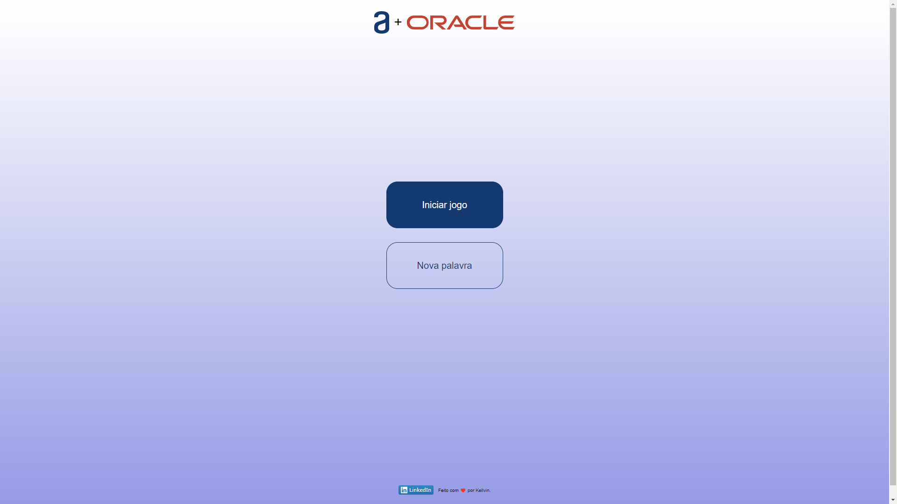
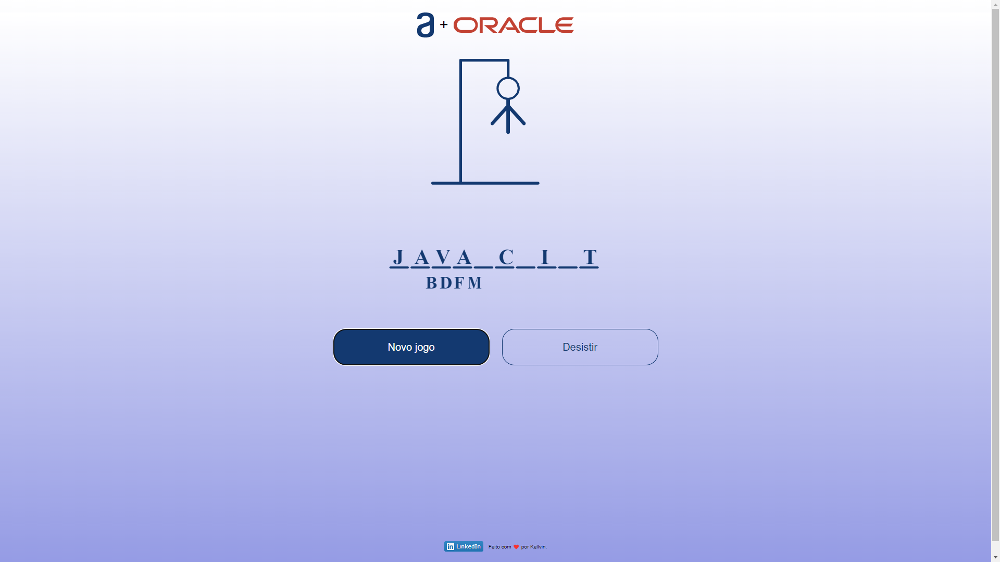
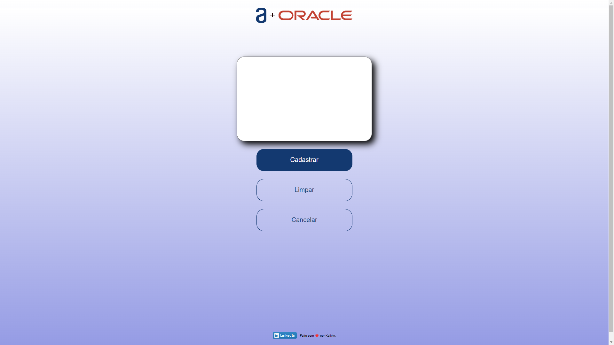

# Jogo-da-Forca-Oracle-Next-Education-Alura

## Introdução:

 

- Ao apertar o botão "Novo jogo", será gerado aleatoriamente uma das palavras já cadastradas no sistema, ao acertar todas as letras você ganha.

- Terá um limite de 6 erros.

- É possível cadastrar uma nova palavra.

 

 

## Tecnologias

 

- HTML
- CSS
- JavaScript

 

Requisitos:

- Funciona apenas com letras maiúsculas
- Não devem ser utilizados letras com acentos nem caracteres especiais
- Minimo 3 letras e máximo de 9 letras.
